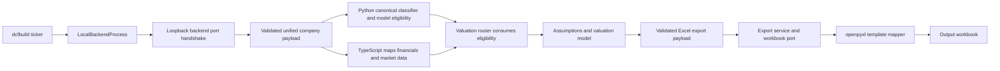

# DCF Builder CLI Architecture

## Input and data

The command accepts one ticker and optional output path. The backend fetches SEC-native statements, profile information, market data, peers, and valuation context through injected provider ports. `create_app(services=None)` uses the default adapters, while tests inject fakes. The CLI validates the response and preserves data-quality states and fallbacks in workbook metadata and terminal warnings.

## Model

The headless TypeScript model maps history, selects default assumptions, and routes from the Python `model_eligibility` result. Operating companies use the multi-scenario DCF. Banks and insurers use residual income, REITs use AFFO, and utilities use dividend growth; each is a simplified specialist draft without generic DCF sensitivities. High-growth and distressed cases stop with the backend's blocking reason when their preferred model is unsupported.

## Workbook

The CLI sends a runtime-validated payload to the local FastAPI export endpoint. The Python exporter writes the existing generic template or a specialist `Sector Model` sheet with visible input cells and linked formulas, then marks formulas for recalculation on workbook open. The live integration suite runs against current provider data for AAPL, JPM, AIG, PLD, NEE, and a blocked high-growth case; each run uses an isolated temporary cache.
