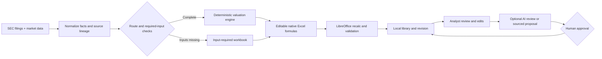

# 🧮 DCF CLI

**Build source-backed, sector-aware DCF workbooks from the command line.**
DCF CLI turns live company data into editable Excel models with native
spreadsheet formulas, explicit source trails, model-specific input checks, and
a local revisioned library.

The calculation and validation path is deterministic code. ChatGPT or Codex can
help review sources, explain formulas, and draft changes; the analyst stays in
control of spreadsheet edits and every approved library update.

> **No invented valuation:** if a supported company is missing required facts,
> DCF CLI creates an input-required workbook with blank editable inputs and
> withholds value. If the company does not meet a supported model route, the
> CLI blocks it.

[Quick start](#-quick-start) · [Model gallery](#-model-gallery) ·
[ChatGPT workflow](#-chatgpt--dcf-cli-workflow) ·
[Known issues](BUGS.md)

## ✨ What it does

- 🏢 Routes companies to separate models for operating companies, banks,
  insurers, REITs, asset managers, telecom, energy, pharma, biotech, and
  utilities.
- 📊 Exports **native Excel formulas** that analysts can inspect and edit.
- 🔎 Keeps SEC filing references and source-quality warnings in the workbook’s
  Data Review sheet.
- 🧮 Recalculates and checks workbook structure, formula counts, cached formula
  errors, and missing-input gates before saving a revision.
- 🗂️ Saves workbooks, manifests, revisions, filing snapshots, and proposals in
  a configurable local model library.
- ✅ Requires explicit approval before a proposed update becomes a new accepted
  revision.

DCF CLI does not claim universal coverage by sector. See the
[model coverage guide](docs/MODEL_COVERAGE.md) for tested examples and
issuer-specific boundaries.

## 🚀 Quick start

Requirements: Node.js **22.5+**, Python **3.11+**, LibreOffice, Internet access,
and an SEC identity string in EDGAR_IDENTITY.

```bash
git clone https://github.com/ryanrodrigues25200525-svg/DCF-CLI.git
cd DCF-CLI
npm run install:all
export EDGAR_IDENTITY="Your Name you@example.com"
npm run install:command
dcf config models-dir --set "$HOME/DCF-Models"
dcf build AAPL
dcf model review AAPL
dcf model open AAPL
```

Each default build writes the accepted library copy plus a dated workbook in
`~/Downloads`, named `YYYY-MM-DD_AAPL_DCF.xlsx` using the UTC build date.
Repeated exports of the same ticker on one day add `_02`, `_03`, and so on.
The library keeps its stable `companies/AAPL/current.xlsx` path.
The filename date is an export/build date, not a substitute for the SEC filing
period shown inside the workbook. Some specialist routes still use annual
actuals; see [Model coverage](docs/MODEL_COVERAGE.md) before assuming a refresh
includes a newly reported quarter.

If LibreOffice is outside the normal search paths, set SOFFICE_PATH. For the
standard macOS app install:

```bash
export SOFFICE_PATH="/Applications/LibreOffice.app/Contents/MacOS/soffice"
```

The installer adds dcf and the legacy standalone dcfbuild command under
~/.local/bin. If your shell does not include that directory yet, open a new
terminal or run npm run dcf -- build AAPL from the repo.

Keep your real SEC identity in your local shell environment. Do not add it to
the repo or a checked-in config file.

## 🏦 Model gallery

These are concrete live-checked routes, not claims that every issuer in a
sector is supported. The links open the model implementations; the commands
generate a current workbook from your own live data.

| Example companies | Model | Status | Implementation |
| --- | --- | --- | --- |
| AAPL, CRM, WMT | Unlevered FCFF DCF | Live-verified | [Operating model](model/src/services/valuation/operating-model.ts) |
| CAT, SNOW | EV/EBITDA and EV/Revenue comparables | Live-verified | [Comparable model](model/src/services/valuation/multiple-model.ts) |
| JPM, BAC | Bank residual income | Live-verified | [Bank model](model/src/services/valuation/bank-model.ts) |
| AIG | P&C insurance residual income | Live-verified | [Insurance model](model/src/services/valuation/insurance-model.ts) |
| PLD | Equity REIT AFFO + NAV | Live-verified | [REIT model](model/src/services/valuation/reit-model.ts) |
| AGNC | Agency mortgage REIT residual income | Live-verified | [Mortgage REIT model](model/src/services/valuation/mortgage-reit-model.ts) |
| BLK, TROW | Asset-manager AUM DCF | Live-verified | [Asset-manager model](model/src/services/valuation/asset-manager-model.ts) |
| T | Telecom subscriber DCF | Live-verified | [Telecom model](model/src/services/valuation/telecom-model.ts) |
| XOM | Integrated-energy DCF | Live-verified | [Integrated-energy model](model/src/services/valuation/integrated-energy-model.ts) |
| PFE | Mature-pharma product DCF | Live-verified | [Mature-pharma model](model/src/services/valuation/mature-pharma-model.ts) |
| MRNA | Biotech pipeline rNPV | Input-required | [Biotech rNPV model](model/src/services/valuation/biotech-rnpv-model.ts) |
| DUK | Regulated-utility DCF | Input-required | [Utility model](model/src/services/valuation/utility-model.ts) |

### Try different model types

```bash
# General operating-company DCF
dcf build AAPL
dcf model review AAPL
dcf model open AAPL

# Bank-specific residual-income model
dcf build JPM

# Equity REIT AFFO and NAV model
dcf build PLD

# Recognized route with missing regulatory facts:
# creates blank required inputs and withholds valuation
dcf build DUK

# Earnings refresh for an existing company (same validated build path)
dcf model update JPM
```

Current SEC and market data can change whether a route is complete on a
particular run. An “input-required” result is intentional: the workbook shows
what must be sourced and filled before the valuation can be used. More examples
and limitations are in [Model coverage](docs/MODEL_COVERAGE.md).

No prefilled company workbook snapshots are checked in. The gallery links to
the actual formula engines, and the commands reproduce current workbooks from
your own data sources instead of distributing stale valuations.

## 🔄 How the workflow works



The pipeline separates jobs that need different standards:

1. **Data services** fetch SEC filings and market context, normalize periods,
   units, and provenance, and report data-quality warnings.
2. **The model router** selects a company-specific formula route or stops with
   an input-required/unsupported result.
3. **The valuation engine and exporter** produce readable forecast schedules,
   assumptions, valuation bridges, sensitivities where supported, and native
   Excel formulas.
4. **Workbook checks** recalculate with LibreOffice and scan for missing
   required inputs and formula errors before the library accepts a revision.
5. **The analyst** reviews every assumption and edits formulas or inputs in a
   spreadsheet app. AI review is optional and cannot silently publish a change.

## 🧰 Commands you’ll use

| Command | Use |
| --- | --- |
| `dcf build AAPL` | Build or rebuild, validate, save a library revision, and create a dated export |
| `dcf model update AAPL` | Explicitly refresh from the latest mapped SEC/market data and create a dated export |
| `dcf model export AAPL` | Copy the accepted library revision to a dated file after review or approval |
| `dcf models list` | Find saved company workbooks |
| `dcf model inspect AAPL` | Check route, source accession, revision, and workbook hash |
| `dcf model review AAPL` | Check formulas, workbook errors, sources, and missing inputs |
| `dcf model open AAPL` | Open the saved workbook in your spreadsheet app |
| `dcf filings sync AAPL` | Refresh filing metadata and queue an update; it never edits a workbook |
| `dcf watch run --interval 300` | Check enabled companies every 300 seconds |
| `dcf model propose-update AAPL` | Save a source-backed proposal using one or more --change entries |
| `dcf model apply ID --approve` | Apply the reviewed proposal as a new revision |
| `dcf model reject ID` | Reject a proposal without changing the workbook |
| `dcf config models-dir [--set <dir>]` | Show or persist the model-library root |
| `dcf watch status\|check\|run\|pause\|resume` | Filing-watch status, one-shot checks, polling, pause/resume |
| `dcf mcp` | Start the local stdio MCP server |

`models list` and `model inspect` also accept `--json` for machine-readable
output. The full command reference lives in the
[model-library guide](docs/MODEL_LIBRARY.md).

The model library can be redirected with DCF_MODELS_DIR or --models-dir PATH.
By default it lives under ~/DCF-Models:

```text
~/DCF-Models/
  library.db
  companies/AAPL/
    current.xlsx
    manifest.json
    revisions/
```

For all options and conflict behavior, see the
[model-library guide](docs/MODEL_LIBRARY.md).

## 🤖 ChatGPT + DCF CLI workflow

Use ChatGPT to **review and explain a model that DCF CLI built**, rather than
asking it to invent a workbook from scratch.

1. Build and validate. Use `dcf build AAPL` for the initial model, or
   `dcf model update AAPL` after a new filing; then run `dcf model review AAPL`.

2. Attach the dated workbook path printed by the CLI, for example
   `~/Downloads/2026-10-03_AAPL_DCF.xlsx`, to a ChatGPT conversation.

3. Ask for a review with a source-first prompt such as:

   > Review this workbook as a financial-model auditor. Map the model route,
   > assumptions, formulas, source references, and valuation bridge. Flag
   > missing or inconsistent inputs and formula errors. Do not invent values or
   > rewrite the workbook. For each proposed factual correction, give the exact
   > sheet and cell, current value or formula, proposed value or formula,
   > rationale, source, and SEC accession. Separate reported facts from analyst
   > assumptions and list the checks you would run after an edit.

4. Apply analyst judgment in Excel. For a source-backed fact correction, sync
   the filing and record a proposal with `dcf model propose-update`; inspect its
   preview, then apply it only after approval with
   `dcf model apply <proposal-id> --approve`. Run `dcf model export AAPL`
   afterward to create a dated copy of the newly accepted library revision.

5. Run `dcf model review AAPL` after the change and inspect the revision/hash
   before relying on the workbook.

ChatGPT's free-form review notes stay in the conversation; source-backed cell
changes become stored proposals. The CLI does not yet save a separate AI review
report in the model library.

**Editing note:** formulas in Excel are editable. The library also detects
manual edits to `current.xlsx`; applying a proposal to a workbook whose hash has
changed is blocked. There is not yet a command to accept a manual edit as a
new library revision. Keep analyst experiments in a separate workbook copy
until that workflow is added. See [known issues](BUGS.md).

### Tool access from Codex or ChatGPT

The project exposes a local stdio MCP server through dcf mcp or:

```bash
npm --prefix model run dcf-mcp --silent
```

Configure its executable and absolute project paths in a local stdio-capable
MCP client. The server uses the same services as the CLI for model discovery,
workbook inspection, filing checks, validation, and sourced proposals.
Applying a proposal still requires explicit approval. The MCP server does not
trigger a full model rebuild; run `dcf model update <ticker>` in the CLI first,
then review the dated workbook with ChatGPT.

For ChatGPT, the app connection needs either a reachable HTTPS MCP endpoint or
a supported Secure MCP Tunnel. DCF CLI currently provides the local stdio
server; it does not host or configure the tunnel for you. See OpenAI’s
[ChatGPT MCP quickstart](https://developers.openai.com/plugins/build/app-quickstart)
and [Secure MCP Tunnel guide](https://developers.openai.com/api/docs/guides/secure-mcp-tunnels).

If you do not configure tool access, the file-upload workflow above still lets
ChatGPT inspect the workbook, but you run DCF CLI commands yourself.

## 🧪 Verification

```bash
npm run typecheck
npm run test:model
```

`test:model` uses live SEC/provider data and real workbook exports. It requires
network access, EDGAR_IDENTITY, Python dependencies, and LibreOffice. It
includes the main live model suite plus a live AAPL check for issuer filings
submitted through a filing agent when the current SEC response contains a
usable mixed filing sample; otherwise the check logs a clear skip. Live
providers can rate-limit or return stale data; model routes fail closed when
required context is missing.
The latest full run on 3 October 2026 passed **82/82 live model tests** in
**869.14 seconds**, and the mixed-list filing-agent regression passed. This
suite verifies named live routes and controls; it does not establish universal
company or sector coverage.

## 📚 Project docs

- [Model coverage and route limits](docs/MODEL_COVERAGE.md)
- [Bugs and open workflow gaps](BUGS.md)
- [Model library, revisions, and proposals](docs/MODEL_LIBRARY.md)
- [API reference](API_DOCS.md)
- [CLI operations](OPERATIONS.md)
- [Project map](PROJECT_MAP.md)
