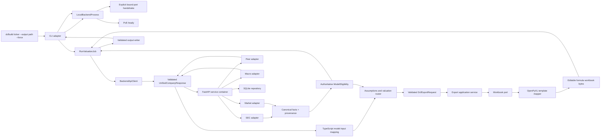

# DCF CLI Architecture Decision

**Status:** Implementation baseline for the current CLI migration
**Scope:** Local ticker-to-Excel CLI, FastAPI data service, and workbook export

## Decision summary

Keep the CLI, TypeScript model, and local FastAPI service. Make Python's canonical financial pipeline and company classifier the only authority for model eligibility. The CLI must validate and consume that eligibility instead of classifying the same company again in TypeScript. Keep the TypeScript valuation engine responsible for calculations and the Python workbook adapter responsible for mapping a validated payload to the existing Excel template.

Add explicit runtime contracts on both sides of the HTTP boundary, an application-level valuation job with replaceable dependencies, a local-backend process adapter with an explicit port handshake, and a backend service container that can be replaced in deterministic tests. Do not add a framework, service, database, or runtime dependency.

## Baseline components and observed flow before the migration

```mermaid
flowchart LR
    Bin[bin/dcfbuild.mjs] --> Cli[model/src/cli.ts]
    Cli --> Spawn[Spawn Uvicorn on 127.0.0.1 port 0]
    Spawn --> Log[Parse Uvicorn log for selected port]
    Cli --> Ready[Poll /ready]
    Ready --> Unified[GET unified/native]
    Unified --> Providers[SEC, market, peers, macro, SQLite cache]
    Providers --> Canonical[Python canonical financials and eligibility]
    Canonical --> Raw[Untyped JSON response]
    Raw --> TSNormalize[TypeScript native normalizer]
    TSNormalize --> TSClassify[TypeScript company classifier]
    TSClassify --> Router[TypeScript valuation router]
    Router --> Payload[TypeScript Excel payload builder]
    Payload --> Export[POST /api/export/dcf/excel as dict]
    Export --> PeerRefresh[Optional peer fetch and static fallback]
    PeerRefresh --> Mapper[OpenPyXL template mapper]
    Mapper --> Bytes[Workbook bytes]
    Bytes --> File[Write output path]
    File --> Stop[Stop child in finally]
```

Before this migration, the data endpoint already returned both `canonical_financials` and `model_eligibility`. Python computed eligibility from canonical SEC data, while TypeScript independently classified the mapped history. The CLI checked the Python answer for support, but did not pass it to `calculateRoutedValuation`; the router recomputed a local answer. The API payloads were mostly dictionaries at runtime even though TypeScript had static interfaces. The CLI's 476-line entry module owned argument parsing, prompting, child-process startup, HTTP, data mapping, model calculations, export, and file writing.

Provider modules are already separated by source, and tests replace their functions with monkeypatches. Cache access has a repository parameter, but app startup and several endpoints use a module-global repository. The export route can fetch peers and insert static peers before calling the workbook mapper. The mapper itself uses the checked-in template and OpenPyXL and has formula-focused tests.

## Options considered

1. **Keep Python as classification authority.** It already builds canonical financials and emits model eligibility in the unified response. TypeScript validates and consumes that decision. This requires the least behavior change and makes the backend's returned canonical facts explain the route.
2. **Move classification entirely to TypeScript.** This would align classification with the valuation router, but the backend currently uses the same decision in its public response. Removing it would change that API and move business logic away from the existing canonical-data owner.
3. **Generate both languages' models from OpenAPI.** This could reduce schema drift, but adds generator tooling and a build dependency. A typed Pydantic contract plus a small TypeScript runtime parser provides the necessary validation without that operational cost.

Option 1 is selected. Python owns the rule; the TypeScript model owns valuation formulas and consumes the result.

Baseline on the inspected worktree before the migration: model tests **91 passed**, backend tests **56 passed**, TypeScript typecheck **passed**. Pytest reported an unset `pytest-asyncio` fixture-loop-scope warning and a Starlette/httpx deprecation warning. Those baseline tests were later removed at the user's direction in favor of live integration checks.

## Responsibilities after migration

| Component | Owns | Does not own |
| --- | --- | --- |
| `bin/dcfbuild.mjs` and CLI adapter | Public command, flags, prompt, output path, user-facing errors | Financial rules or API response parsing |
| Local backend process adapter | Child startup, explicit port discovery, readiness polling, shutdown | HTTP payload construction or valuation |
| TypeScript API client | HTTP calls and runtime validation of unified-data and export contracts | Data acquisition providers or company classification |
| Valuation job use case | Normalize returned data for the model, assumptions, valuation, warnings, export request | Process spawning or direct filesystem writes |
| Python canonical/classification domain | Canonical financial facts, provenance, company type, preferred model, eligibility, blocked reasons | Forecast calculation or Excel layout |
| Python data adapters and service ports | SEC, market, peer, macro, cache implementations | Valuation decisions or workbook cell layout |
| Export application service | Validate export request, optional peer enrichment, call workbook port | SEC/market retrieval outside the explicit peer-enrichment path |
| Excel workbook adapter | Map validated values into the existing template and preserve formulas | Provider lookup, company classification, silent data repair |

## Source of truth: model eligibility

`backend/app/services/valuation/classifier.py` remains the authoritative company classification and eligibility implementation. It consumes `canonical_financials`, which preserves sourced values and derivation metadata. Its typed result defines the company type, preferred model, route availability, readiness status, missing-input gaps, allowed models, and blocking reasons. `ready`, `input_required`, and `unsupported` distinguish a usable route from source readiness.

TypeScript keeps a matching contract type for transport safety, but no second classification algorithm. The CLI requires `model_eligibility`; a missing or invalid result is a contract error. The valuation job calculates only `ready` models. For `input_required`, it skips valuation and exports the selected family's workbook with blank, unlocked inputs, a source-reference register, and formulas gated on `READY`. `unsupported` is rejected with the backend's blocking reason and no workbook. Workbook support guards validate that the payload uses a supported model identifier; they do not reclassify the issuer.

## Current model support boundary (2026-10-02)

- Incomplete workbooks are live-tested for the operating DCF (AAPL), commercial bank (JPM), P&C insurance (AIG), equity REIT (PLD), agency mortgage REIT (AGNC), traditional asset manager (BLK), telecom (AT&T), regulated utility (DUK), integrated energy (XOM), mature pharma (PFE), pipeline biotech (MRNA), and trading-comparable (CAT/SNOW) routes. Missing amounts remain blank; the workbook does not present a partial value. After values and source references are entered, Excel recalculates the model. These issuer checks do not establish coverage for every company in the sector.
- Comparable routes keep a current peer row when one denominator is missing and accept that metric only as an explicit sourced input. The exporter preserves the missing state even if an EV/metric multiple is present; it does not back-solve the missing metric. Peer medians, the common-equity bridge outputs, sensitivity, and per-share values remain blank until the peer inputs pass checks. TGT is recognized as a multiple-model issuer but receives an input-required shell with no fallback peer rows when only the fallback universe is available.

- Source-ready technology hardware, subscription software, and consumer retail issuers use a five-year FCFF DCF with editable, source-derived operating profiles. DCF terminal multiples require three current curated EV/EBITDA peers; a current-market multiple fallback is not used.
- Source-ready issuers that fail a DCF input gate may use the separate formula-based EV/EBITDA or EV/Revenue model when the target metric, three current peers, and common-equity bridge are source-ready. The workbook shows peer metrics, median formulas, an optional editable multiple override, sensitivities, and debt/cash/securities/NCI/preferred/share bridge. A missing peer denominator can be entered in the incomplete workbook with an accompanying source reference.
- Live operating examples currently passing DCF exports are AAPL, CRM, and WMT. CAT passes a direct EV/EBITDA workbook; SNOW passes EV/Revenue. NVDA receives an input-required workbook for its missing current filed CapEx/security inputs. TGT receives an input-required shell when only a fallback peer universe is available.
- Subscription software uses filed aggregate operating net working capital when inventory/payables are not separately disclosed. The workbook keeps missing component mappings in Data Review and uses an editable residual-to-revenue input to reconcile the filed aggregate balance.
- DCF WACC requires dated market rates, beta, market capitalization, filed tax and debt values, and a current peer multiple. When a current effective tax rate exceeds the supported range, the assumption uses a labeled average of source-ready filed rates from the latest three years. AAPL's missing standalone interest-expense line uses a clearly labeled midpoint from its filed 2025 debt-issuance rate range, not a current weighted-average borrowing yield.
- Data-ready commercial banks use `bank_residual_income`. JPM and BAC passed live source mapping, CLI export, workbook formula, and Artifact Tool recalculation checks. Goldman Sachs is blocked as an investment-bank subtype.
- AIG uses `insurance_pnc_residual_income`, with General Insurance underwriting and reserve schedules, a statutory-capital proxy, and a common-equity residual-income valuation. MET and PRU use `life_insurer_distributable_earnings_dcf`: MET's adjusted earnings remain after tax; PRU's pre-tax operating income uses a blank source-required tax assumption. Their filed RBC, statutory-capital, and dividend disclosures keep legal-entity scope; capital retention, upstream capacity, parent cash/reserve/debt/claims, and missing market inputs remain blank until sourced. Other life insurers remain blocked.
- PLD uses `reit_affo`, with SEC-sourced NAREIT/Core FFO bridges, analyst-defined AFFO, same-store NOI growth, a common-equity AFFO DCF, and a property-only NAV cross-check.
- AGNC uses `mortgage_reit_residual_income`, a five-year common-equity residual-income model. The workbook separates filed GAAP and TBA/swap economic interest, forecasts swap coverage and net pay rate explicitly, reconciles the filed preferred/common and total balance-sheet bridges, and contains editable assumptions and sensitivities. It does not calculate enterprise value. FY2025 is the latest annual operating base; FY2026 quarterly results are not included. The parser is issuer-specific to AGNC's agency MBS tables; commercial mortgage REITs such as STWD and other agency issuers remain blocked until their own source contracts are mapped.
- XOM uses `integrated_energy_dcf`, a five-year unlevered enterprise DCF grounded in filed production, realized prices, production costs, proved reserves, GAAP segment earnings, interest-bearing debt, Cash CapEx, and operating working capital. The forecast keeps upstream production economics, downstream segments, and corporate operating earnings visible; the reserve roll-forward is a production check rather than a second NAV valuation. Filed Brent, Henry Hub, and TTF sensitivities remain separate checks. The workbook passed live SEC mapping, live CLI export, LibreOffice formula recalculation, engine parity, and sensitivity checks. FY2025 is the latest annual base; FY2026 quarterly operations are not included. CVX, independent E&Ps, miners, and other energy issuers remain blocked until their filings support separate source contracts.
- PFE uses `mature_pharma_product_dcf`, a five-year FCFF DCF with filed product revenues, separate U.S./major-Europe/Japan patent dates, and editable product growth, modeled global LOE, and erosion inputs. The global LOE year starts from the filed U.S. basic patent year because product territory mix and generic-entry timing are not disclosed. The workbook passed live SEC mapping, PFE-only CLI export, LibreOffice recalculation, engine parity, and LOE/WACC sensitivity checks. FY2025 is the latest annual base; pipeline NAV is excluded. MRK and other mature-pharma issuers remain blocked until their own source contracts pass.
- MRNA uses `biotech_pipeline_rnpv` only for its live SEC-mapped Moderna asset inventory. The workbook starts its commercial DCF from reported consolidated revenue, forecasts individually mapped late-stage candidates over a finite 35-year schedule, and gives every other filing-listed candidate an explicit inclusion control and analyst-entered rNPV. Sales, launch years, PoS, partner economics, margins, and development costs stay blank and source-referenced. The route passed live CLI export, LibreOffice missing/invalid/restored-input recalculation, editable formula tests, sensitivity checks, and TypeScript engine parity; it does not enable other biotech issuers.
- MRNA has an input-required pipeline DCF because its live 10-K does not report the asset-level commercial revenue, launch-timing, partner-economics, probability, or remaining-development inputs needed for source-complete valuation. MET and PRU have input-required distributable-earnings DCFs because source-ready company-level capital-retention and upstream-distribution forecasts are not reported. DUK receives a blank-input rate-base DDM; SO still lacks a validated rate-base source contract, and mixed-utility NEE remains blocked until regulated and unregulated segments are separated.
- Source-ready traditional asset managers use `asset_manager_aum_dcf`. BlackRock (BLK) and T. Rowe Price (TROW) passed live SEC source mapping, five-year engine checks, dedicated formula workbook checks, and LibreOffice recalculation. The model separates AUM flows, market changes, realizations, acquisitions, FX/scope changes, advisory/performance fees, capital-allocation income when reported, operating cash-flow inputs, and the common-equity bridge. Its starting actual period is FY2025; current quarterly AUM is not yet included. Invesco (IVZ) remains blocked for incomplete base-fee/flow history; alternative managers BX and KKR remain blocked until a separate carry and principal-investment model is implemented.
- AT&T (T) uses `telecom_subscriber_dcf`, a five-year subscriber-and-segment FCFF model. Filed postpaid phone churn and net additions drive postpaid phone customers; other wireless customers, Mobility service/equipment revenue, Consumer broadband connections/revenue, Business Wireline, Latin America, and the consolidation residual remain separate. Network CapEx, filed interest-bearing debt/cost of debt, and cash-flow-derived operating working capital feed the FCFF and common-equity bridge. The dedicated workbook passed LibreOffice and Artifact Tool recalculation, formula-error scans, sensitivity checks, and engine parity. It starts from FY2025 actuals; 2026 quarterly results and post-year-end transactions are excluded. VZ receives a required-input workbook listing its missing data; it does not yet receive the dedicated formula schedule or a valuation.
- DUK's utility workbook remains input-required until jurisdictional rate base, authorized returns/capital structure, projected additions, depreciation, and payout policy are entered with appropriate source notes. It uses a five-year rate-base DDM and does not display enterprise value. NEE's regulated and unregulated segments are not separately valued.
- Bank eligibility requires source-backed NII, asset/funding balances, loans, deposits, credit provisions, CET1, RWA, common equity, distributions, diluted shares, and current dated market inputs. Missing or ambiguous lines block export.
- Bank workbooks contain no corporate FCFF or enterprise-value bridge. They show filed history and provenance, editable assumptions, formula-driven income and capital schedules, a residual-income equity valuation, a cost-of-equity/terminal-growth sensitivity, and a `Data Review` sheet.
- Bank CET1 rolls forward as opening CET1 plus net income less common distributions. Regulatory deductions, AOCI, and supervisory adjustments are not separately forecast; the workbook discloses that proxy and the source for the editable minimum CET1 ratio.

The current fixed ten-column workbook timeline and its existing projection/padding behavior are preserved by this migration. The CLI options, prompt, default output path, overwrite rule, workbook template, formula layout, warnings, and specialist routes remain compatible.

## Target data and control flow

## Contracts and data preservation

- The unified-data response is a Pydantic response model with explicit profile, native statements, canonical financials, eligibility, market/context, quality, completeness, and source-metadata fields. Statement rows allow dynamic fiscal-year columns and extra source fields so periods, units, concepts, row IDs, and nulls survive validation.
- The export request is a Pydantic request model with separate complete and `input_required` rules. Ready exports require market, historicals, assumptions, and forecasts; incomplete exports require a production route, canonical provenance, and a structured input manifest. Runtime validation does not fill missing values with zero or discard source warnings.
- The TypeScript client parses both responses from `unknown`, reports the failing field path, and preserves unknown allowed metadata while converting the boundary to domain types.
- Wire aliases and existing route paths stay unchanged. A schema change that alters the public JSON shape requires an intentional migration rather than a silent casing change.

## Replaceable services and local process

The FastAPI app receives a `RuntimeServices` container at construction. It exposes narrow protocols for SEC, market, peer, macro, cache, and workbook operations. The default container adapts the current `edgar`, `finance`, SQLite repository, and Excel exporter modules. The live integration suite exercises these adapters through the CLI with an isolated temporary cache.

The CLI binds only to loopback and requests an OS-selected ephemeral port. `backend/app/local_server.py` binds the socket and emits a stable machine-readable port line; `LocalBackendProcess` polls `/ready`, forwards errors without identity values, and always stops the child in `finally`. Tests cover port parsing, early child exit, readiness timeout, already-exited children, and forced shutdown. The output writer validates workbook bytes and uses exclusive create unless `--force` is supplied.

## Implemented migration sequence

1. Define shared eligibility and API contracts in Python; remove the TypeScript classifier and pass the required eligibility through the valuation route.
2. Add the TypeScript API client and runtime parsers, and Pydantic models for unified data and export requests. Add shared deterministic contract fixtures.
3. Add the FastAPI `RuntimeServices` container and replace direct provider/global-repository access at route boundaries. Keep existing provider modules as default adapters.
4. Split the TypeScript CLI into process, client, valuation-job, and output-writer modules. Keep CLI flags, prompt, and default paths unchanged.
5. Keep peer enrichment in an export application service and make the workbook adapter accept only a validated payload. Confirm formula and source-review behavior with live source-backed integration cases.
6. Update README, API, operations, and project-map docs to describe the final boundaries, current model support, live checks, and remaining limitations.

## Verification limits and risks

- The 79-test live-only suite makes SEC, market, macro, and peer requests. It requires a configured `EDGAR_IDENTITY`; CLI cases use isolated temporary caches. It covers ready, input-required, and unsupported outcomes across DCF, EV/EBITDA, EV/Revenue, bank, P&C insurance, life insurance, equity REIT, traditional asset management, telecom, regulated utility, agency mortgage REIT, integrated energy, mature pharma, MRNA pipeline biotech, and unsupported specialist/fallback-peer routes.
- The suite checks live source lineage, editable assumptions and formulas, peer medians, equity bridges, input restoration, invalid-input withholding, and the five-year DCF horizon when only three reported years are included. Representative DCF, comparable, and specialist workbooks are recalculated with LibreOfficeDev. Tested engine/workbook values tied within 0.1% equity value and $0.01 per share; no formula errors appeared. Revenue growth, margin, CapEx, terminal growth, shares, peer inputs, and direct formula edits moved dependent outputs as expected.
- JPM, BAC, AIG, PLD, AAPL, CRM, WMT, CAT, and SNOW have issuer-specific live mapping or export checks. These examples validate only the tested issuers and routes; they do not establish universal coverage.
- The fixed ten-column workbook timeline leaves leading period columns blank when fewer than five historical years are present, keeping the engine's five forecast years in the final five columns.
